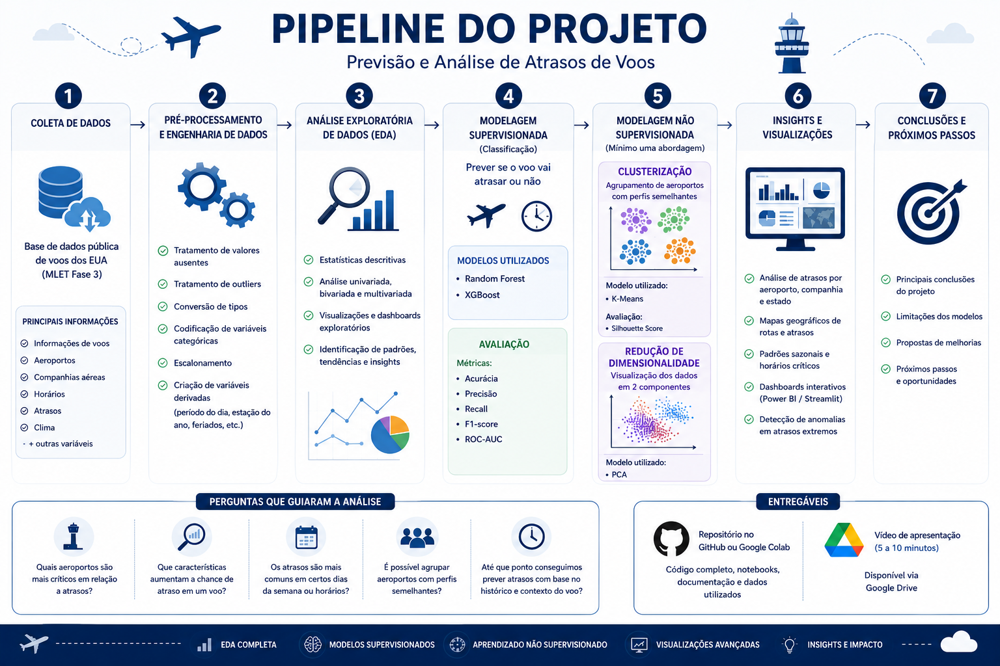
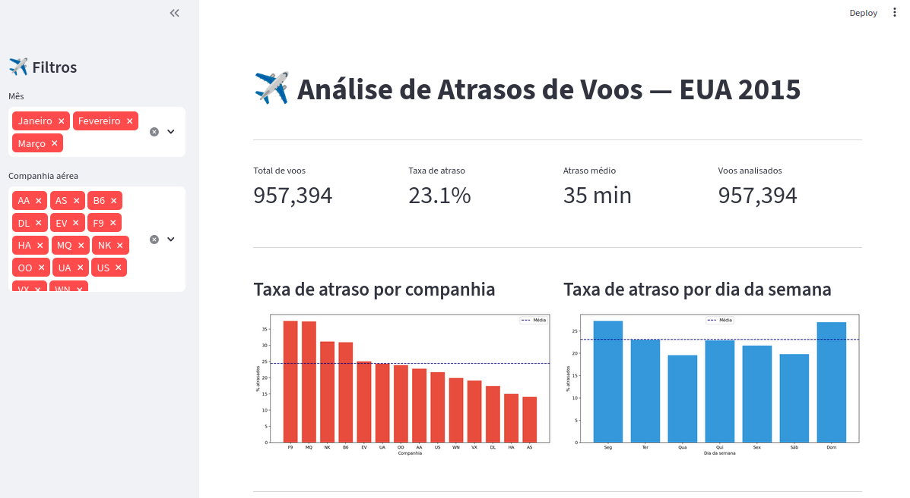

# ✈️ Análise e Predição de Atrasos de Voos


> Pipeline completo de Machine Learning para análise, classificação e clusterização de atrasos de voos nos EUA utilizando técnicas supervisionadas e não supervisionadas.


---

# 📋 Índice

- [📌 Sobre o Projeto](#-sobre-o-projeto)
- [🚀 Destaques Técnicos](#-destaques-técnicos)
- [🏗️ Estrutura do Projeto](#️-estrutura-do-projeto)
- [🗄️ Base de Dados](#️-base-de-dados)
- [📊 Pipeline do Projeto](#-pipeline-do-projeto)
- [📈 Dashboard Interativo](#-dashboard-interativo)
- [📊 Principais Resultados](#-principais-resultados)
- [🤖 Modelos Utilizados](#-modelos-utilizados)
- [▶️ Como Executar](#️-como-executar)
- [🛠️ Tecnologias](#️-tecnologias)
- [📝 Limitações e Próximos Passos](#-limitações-e-próximos-passos)
- [🎯 Conclusão](#-conclusão)
- [👨‍💻 Autor](#-autor)

---

# 📌 Sobre o Projeto

O transporte aéreo é uma parte vital da infraestrutura global, mas os atrasos de voos impactam milhões de passageiros todos os anos. Este projeto utiliza um conjunto de dados público com informações detalhadas sobre voos nos EUA para desenvolver análises e modelos preditivos aplicando técnicas de **Machine Learning supervisionado e não supervisionado**.

## 🎯 Objetivos

- Explorar e entender padrões de atraso nos voos americanos
- Prever se um voo irá atrasar ou não (classificação)
- Agrupar aeroportos por perfil operacional (clusterização)
- Identificar voos anômalos (detecção de anomalias)
- Demonstrar aprendizado semi-supervisionado
- Construir um pipeline completo de Data Science

---

# 🚀 Destaques Técnicos

- Pipeline completo de Data Science
- Processamento de 1 milhão de registros
- Feature Engineering
- Classificação supervisionada
- Clusterização com K-Means
- Redução de dimensionalidade com PCA
- Detecção de anomalias
- Semi-supervised learning
- Dashboard interativo com Streamlit
- Visualização geográfica de rotas
- Análise exploratória avançada (EDA)

---

# 🏗️ Estrutura do Projeto

```bash
tech-challenge-fase3/
│
├── assets/                   # Imagens
├── dashboard/                # Dashboard Streamlit
├── docs/                     # Documentos do projeto 
├── notebooks/                # Análises e experimentos
├── outputs/                  # Imagem gerada pelos experimentos
│
├── requirements.txt
└── README.md
```

---

# 🗄️ Base de Dados

| Arquivo | Descrição | Tamanho |
|---|---|---|
| `flights.csv` | 5,8 milhões de voos (Jan-Mar/2015) | 565 MB |
| `airports.csv` | Informações e coordenadas de 322 aeroportos | 24 KB |
| `airlines.csv` | Códigos e nomes das companhias aéreas | 359 B |

> ⚠️ Os arquivos CSV não estão versionados no repositório devido ao tamanho elevado.

## 📌 Principais Variáveis

| Variável | Descrição |
|---|---|
| `ARRIVAL_DELAY` | Utilizada para derivar a variável alvo binária |
| `IS_DELAYED` | Variável alvo (`ARRIVAL_DELAY >= 15`) |
| `DEPARTURE_DELAY` | Minutos de atraso na partida |
| `AIRLINE` | Companhia aérea |
| `ORIGIN_AIRPORT` | Aeroporto de origem |
| `DESTINATION_AIRPORT` | Aeroporto de destino |
| `MONTH` | Mês do voo |
| `DAY_OF_WEEK` | Dia da semana |
| `SCHEDULED_DEPARTURE` | Horário previsto |
| `DISTANCE` | Distância em milhas |
| `CANCELLED` | Indicador de cancelamento |

---

# 📊 Pipeline do Projeto

<p align="center">
  
</p>

O pipeline do projeto foi dividido nas seguintes etapas:

1. Coleta e entendimento dos dados
2. Pré-processamento e engenharia de atributos
3. Análise exploratória (EDA)
4. Modelagem supervisionada
5. Modelagem não supervisionada
6. Visualizações e insights
7. Conclusões e próximos passos

---

# 📈 Dashboard Interativo

O projeto também conta com um dashboard interativo desenvolvido com Streamlit para exploração visual dos dados.

<p align="center">
  
</p>

## Funcionalidades

- Análise de atrasos por companhia aérea
- Visualização por aeroportos
- Mapas geográficos de rotas
- Distribuições temporais
- Filtros dinâmicos
- Indicadores operacionais

---

# 📊 Principais Resultados

## ✈️ Taxa geral de atraso

> **23,1%** dos voos atrasaram 15 minutos ou mais.

---

## 🚨 Companhias aéreas com maiores atrasos

| Companhia | Taxa de Atraso |
|---|---|
| F9 — Frontier Airlines | 37,6% |
| MQ — Envoy Air | 37,5% |
| NK — Spirit Airlines | 31,3% |

---

## ✅ Companhias aéreas com melhor desempenho

| Companhia | Taxa de Atraso |
|---|---|
| AS — Alaska Airlines | 14,2% |
| HA — Hawaiian Airlines | 15,1% |
| DL — Delta Airlines | 17,6% |

---

## 📌 Padrões Identificados

- 📅 **Piores dias:** Segunda-feira e Domingo (27,3%)
- 🌙 **Pior período:** Noite (29,0%)
- 📆 **Pior mês:** Março (32,3%)
- 🏢 **Aeroporto mais crítico:** ORD — Chicago O'Hare (35,6%)
- ⚡ **Principal causa:** Sistema aéreo (23 min médios)

---

## 🧩 Clusters de Aeroportos

| Cluster | Perfil | Aeroportos | Taxa de Atraso |
|---|---|---|---|
| 🟢 Excelente | Menor congestionamento | 31 | 16% |
| 🟡 Bom | Desempenho mediano | 64 | 21% |
| 🟠 Ruim | Problemas frequentes | 42 | 26% |
| 🔴 Crítico | Piores aeroportos | 13 | 33% |

---

# 🤖 Modelos Utilizados

## 🔹 Modelagem Supervisionada — Classificação

| Modelo | Accuracy | ROC-AUC | Recall | F1 |
|---|---|---|---|---|
| Regressão Logística | 93% | 0.964 | 79% | 0.84 |
| Random Forest | 92% | 0.968 | 73% | 0.81 |

### 📌 Conclusões

- A **Regressão Logística** apresentou melhor Recall
- O modelo identificou corretamente a maior parte dos voos atrasados
- `DEPARTURE_DELAY` foi a variável mais importante (89,8%)
- Os resultados reforçam o efeito cascata de atrasos operacionais

---

## 🔹 Modelagem Não Supervisionada

| Técnica | Resultado |
|---|---|
| K-Means (k=4) | 4 clusters de aeroportos identificados |
| PCA 2D | 79,2% da variância explicada |

---

## 🔹 Técnicas Avançadas (Exploração Opcional)

| Técnica | Resultado |
|---|---|
| Isolation Forest | 1% de voos anômalos |
| Label Propagation | 87% de accuracy com apenas 10% de labels |

---

# ▶️ Como Executar

## 📌 Pré-requisitos

- Python 3.12+
- Arquivos CSV da base de dados

---

## ⚙️ Instalação

```bash
# 1. Clonar o repositório
git clone https://github.com/JonatasLocateli/tech-challenge-fase3.git

# 2. Entrar na pasta do projeto
cd tech-challenge-fase3

# 3. Criar ambiente virtual
python -m venv venv

# 4. Ativar ambiente virtual

# Linux/Mac
source venv/bin/activate

# Windows
venv\Scripts\activate

# 5. Instalar dependências
pip install -r requirements.txt

# 6. Iniciar Jupyter Notebook
jupyter notebook
```

Abrir:

```bash
tech_challenge3.ipynb
```

Executar:

```bash
Kernel → Restart & Run All
```

---

## 📈 Executar Dashboard

```bash
streamlit run dashboard.py
```

Acessar:

```bash
http://localhost:8501
```

---

# 🛠️ Tecnologias

| Tecnologia | Uso |
|---|---|
| Python 3.12 | Linguagem principal |
| Pandas | Manipulação de dados |
| NumPy | Computação numérica |
| Matplotlib | Visualizações |
| Seaborn | Visualizações estatísticas |
| Scikit-learn | Modelagem de Machine Learning |
| Folium | Mapas interativos |
| Streamlit | Dashboard interativo |
| Jupyter Notebook | Desenvolvimento analítico |

---

# 📝 Limitações e Próximos Passos

## ⚠️ Limitações

1. Base cobre apenas Jan-Mar/2015
2. `DEPARTURE_DELAY` domina o modelo
3. Amostra de 1M linhas representa ~17% da base total
4. Dados históricos podem não refletir padrões atuais

---

## 🚀 Próximos Passos

1. Treinar modelos sem `DEPARTURE_DELAY`
2. Incorporar dados climáticos externos
3. Utilizar a base completa
4. Testar XGBoost e redes neurais
5. Expandir análise para todos os meses do ano
6. Publicar dashboard online

---

# 🎯 Conclusão

O projeto demonstrou que técnicas de Machine Learning conseguem identificar padrões relevantes em atrasos de voos com alta capacidade preditiva.

Ambos os modelos supervisionados aplicados performaram muito bem com AUC acima de 0.96. O principal preditor de atraso é o atraso na partida, confirmando o efeito cascata. 
Além da classificação supervisionada, métodos não supervisionados permitiram segmentar aeroportos por perfil operacional e identificar comportamentos anômalos relevantes.

As principais limitações são: a base cobre apenas 3 meses de 2015. Foi utilizado 17% da base total por limitação de hardware, e o modelo depende do DEPARTURE_DELAY — que só é conhecido quando o voo já está atrasando. 
Um próximo passo seria treinar um modelo usando apenas variáveis conhecidas antes do voo, como companhia, horário e aeroporto.

Os resultados reforçam como engenharia de dados, análise exploratória e modelagem estatística podem gerar insights estratégicos para o setor aéreo.

---

# 👨‍💻 Autor

**Jonatas Locateli**  
FIAP Pós Tech — Machine Learning Engineering — Fase 3

---
